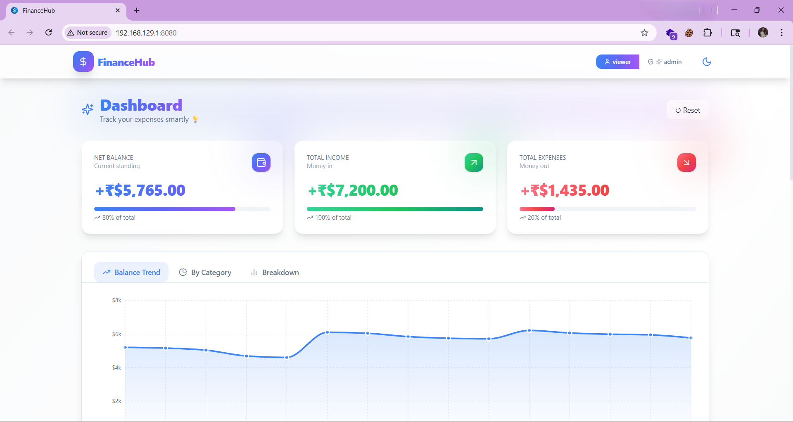
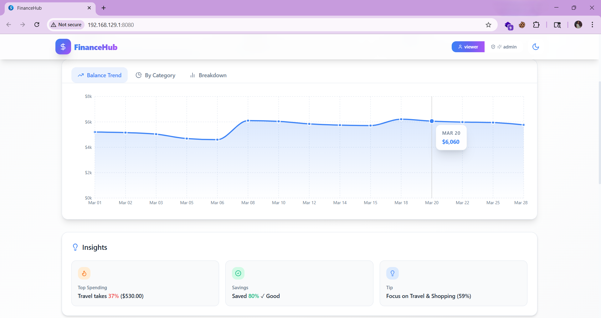
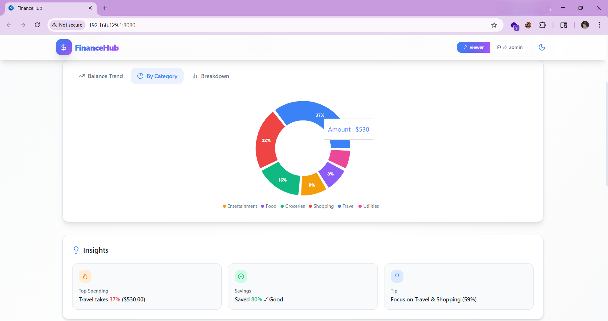
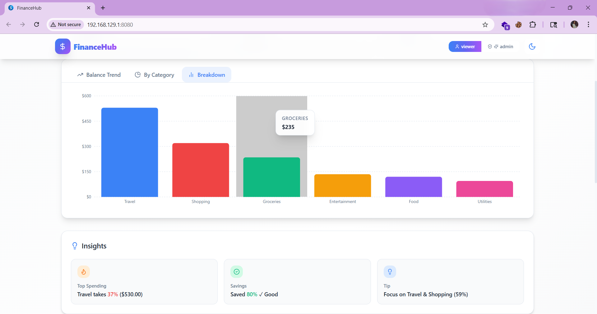
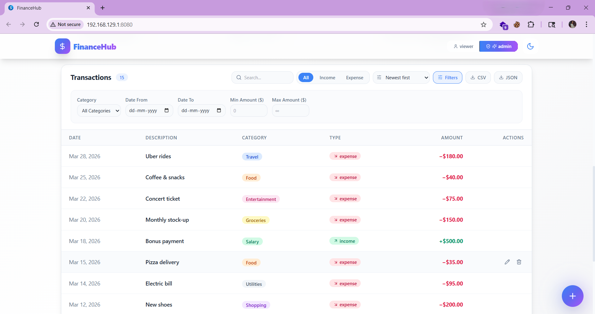
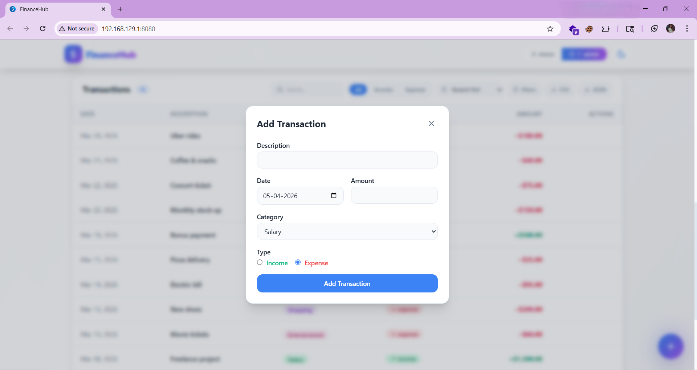
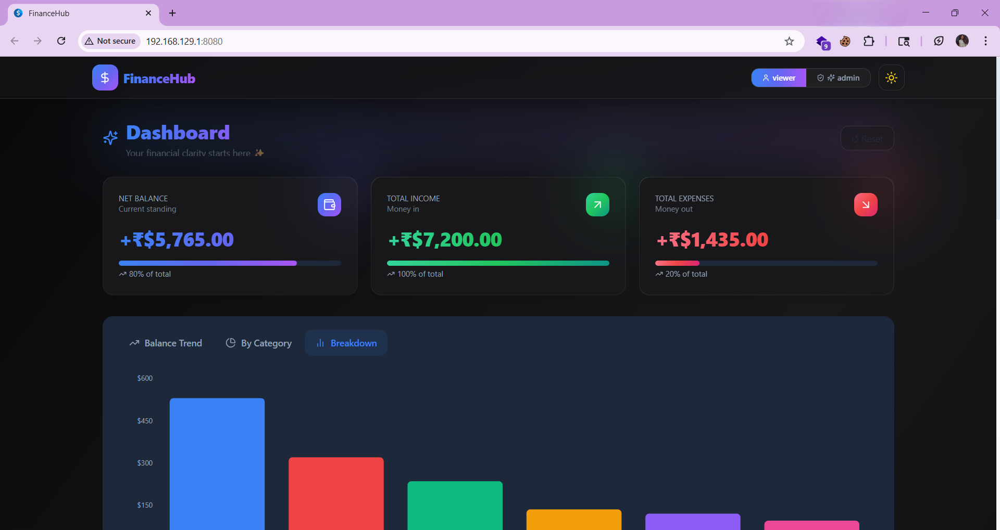

# Finance Dashboard UI

### Overview

A clean and interactive Finance Dashboard built using React, TypeScript, and Tailwind CSS.
This application helps users track income, expenses, and financial insights in a simple and beginner-friendly way.

### Features


| Feature | Description |
|---|---|
|  **Charts** | Area, Pie & Bar charts with tabbed navigation |
|  **Transactions** | Add, edit, delete with animated table |
|  **Advanced Filters** | Search, date range, amount range, category |
|  **Export** | Download transactions as CSV or JSON |
|  **Dark Mode** | Toggle between light and dark themes |
|  **Local Storage** | Data persists across page refreshes |
|  **Mock API** | Simulated async API with loading states |
|  **Animations** | Smooth transitions via Framer Motion |
|  **Responsive** | Works on mobile, tablet and desktop |
|  **Role Access** | Admin (full access) and Viewer (read-only) modes |

 
### Getting Started

**Prerequisites**

Make sure you have the following installed:

- [Node.js](https://nodejs.org/) v18 or higher
- npm v9 or higher

Check your versions:
```bash
node -v
npm -v
```

**Installation**
```bash
# 1. Clone the repository
git clone https://github.com/Vaishnavidasyam/Finance-dashboard-UI.git

# 2. Navigate into the project
cd Finance-dashboard-UI

# 3. Install dependencies
npm install

# 4. Start the development server
npm run dev
```

Open your browser at **http://localhost:8080** 


### Available Scripts

| Command | Description |
|---|---|
| `npm run dev` | Start development server at localhost:8080 |
| `npm run build` | Build for production |
| `npm run preview` | Preview production build locally |
| `npm run lint` | Run ESLint checks |
| `npm run test` | Run unit tests |


### Tech Stack

| Technology | Purpose |
|---|---|
| [React 18](https://react.dev/) | UI framework |
| [TypeScript](https://www.typescriptlang.org/) | Type safety |
| [Vite](https://vitejs.dev/) | Build tool & dev server |
| [Tailwind CSS](https://tailwindcss.com/) | Utility-first styling |
| [Framer Motion](https://www.framer.com/motion/) | Animations |
| [Recharts](https://recharts.org/) | Charts & data visualization |
| [shadcn/ui](https://ui.shadcn.com/) | UI component library |
| [Lucide React](https://lucide.dev/) | Icons |
| [date-fns](https://date-fns.org/) | Date formatting |


### Project Structure


```
src/
├── components/
│   └── dashboard/
│       ├── Navbar.tsx             # Top navigation bar
│       ├── SummaryCards.tsx       # Balance, income & expense cards
│       ├── Charts.tsx             # Area, Pie & Bar charts
│       ├── InsightsBox.tsx        # Smart spending insights
│       ├── TransactionsTable.tsx  # Filterable transactions table
│       └── TransactionModal.tsx   # Add / edit transaction modal
│
├── data/
│   └── mockData.ts               # 15 realistic mock transactions
│
├── hooks/
│   ├── useTransactions.ts        # API hook with loading & error state
│   └── useLocalStorage.ts        # Persistent localStorage hook
│
├── services/
│   └── transactionService.ts     # Mock async API service
│
├── utils/
│   ├── calculations.ts           # Totals, category & trend helpers
│   └── exportUtils.ts            # CSV & JSON export logic
│
└── pages/
    └── Index.tsx                # Main dashboard page
```
 


### Live Demo

https://finance-dashboard-ui-yojq.vercel.app


### Screenshots

**Dashboard**


**Charts**




**Transactions**


**Add Transaction**


**Dark Mode**



### Highlights

Beginner-friendly design
Clean and responsive UI
Real-world architecture
Fully functional (CRUD + filters + charts)


### Author

**Vaishnavi Dasyam**
- GitHub: [@Vaishnavidasyam](https://github.com/Vaishnavidasyam)
- Project: [Finance-dashboard-UI](https://github.com/Vaishnavidasyam/Finance-dashboard-UI.git)
